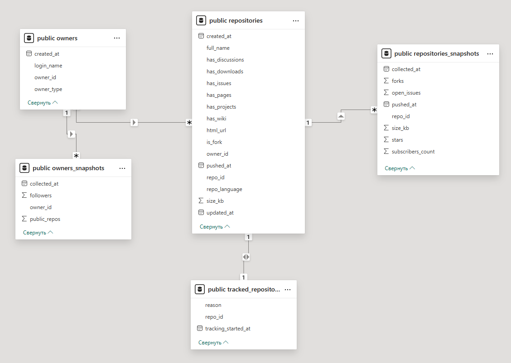
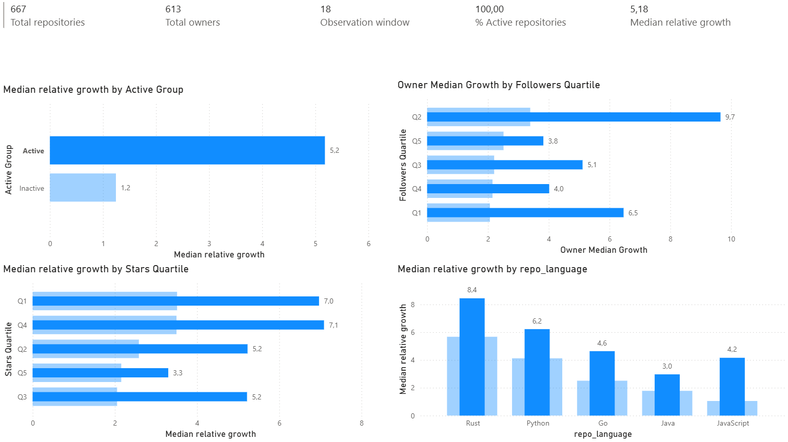

# GitHub Repository Growth Analysis


## Overview

This project demonstrates an end-to-end pipeline for collecting, storing, and analyzing GitHub repository data.
It demonstrates how repository growth, feature adoption, and activity patterns can be tracked over time 
using snapshots, and how insights can be visualized through interactive dashboards.

The project includes:
- Data collection via GitHub API
- Storage and management in PostgreSQL
- Historical snapshots for longitudinal analysis
- Exploratory data analysis and visualization
- Power BI dashboard for interactive exploration


## Data Collection

Repositories are collected using targeted GitHub Search API queries to capture projects at different maturity stages:
- fast-growing, mid-popular, and top ecosystem repositories
- multiple programming languages (Python, JavaScript, Go, Rust, Java)
- snapshots are collected periodically to track stars, forks, issues, and other metrics

This allows for longitudinal growth and feature analysis.

## Repository Categories

Repositories are grouped into analytical categories based on:
- primary programming language
- number of stars
- recent development activity (`pushed_at`)

These groups represent different stages of repository maturity (e.g. fast-growing, mid-popular, established ecosystem).


### Grouping Criteria

| Group Name             | Language / Topic               | Stars Range | Recent Activity (pushed) | Additional Filters    | Pages × per_page | Purpose                                             |
| ---------------------- | ------------------------------ | ----------- | ------------------------ | --------------------- | ---------------- | --------------------------------------------------- |
| `python_mid_popular`   | Python                         | 200–1,000   | After 2024-01-01         | —                     | 6 × 50           | Established but actively maintained Python projects |
| `python_fast_growing`  | Python                         | 50–200      | After 2024-03-01         | —                     | 4 × 50           | Early-stage Python repositories with recent growth  |
| `python_top_ecosystem` | Python                         | >5,000      | No filter                | —                     | 2 × 30           | Mature Python ecosystem leaders                     |
| `js_mid_popular`       | JavaScript                     | 200–1,000   | After 2024-01-01         | Excludes TypeScript   | 8 × 50           | Actively developed JavaScript projects              |                     |
| `go_mid_popular`       | Go                             | 100–800     | After 2024-01-01         | —                     | 5 × 50           | Mid-sized Go projects with stable activity          |
| `go_fast_growing`      | Go                             | 50–150      | After 2024-03-01         | —                     | 2 × 50           | Fast-growing Go repositories                        |
| `rust_mid_popular`     | Rust                           | 300–1,500   | After 2024-01-01         | —                     | 3 × 50           | Established Rust projects                           |
| `rust_fast_growing`    | Rust                           | 50–300      | After 2024-03-01         | —                     | 3 × 50           | Emerging Rust repositories                          |
| `java_mid_popular`     | Java                           | 300–2,000   | After 2024-01-01         | —                     | 6 × 50           | Actively maintained Java projects                   |
| `java_top_legacy`      | Java                           | >3,000      | No filter                | —                     | 2 × 30           | Mature and legacy Java ecosystem repositories       |


## Data Storage

Collected data is stored in a PostgreSQL database using SQLAlchemy.

The data model includes:
- `owners` and `owners_snapshots`
- `repositories` and `repositories_snapshots`
- `tracked_repositories` to manage active tracking

Snapshot tables allow tracking metric changes over time rather than relying on a single static observation.



*Diagram showing main entities and snapshot tables.*

## Exploratory Data Analysis

The first analysis stage is performed in the `01_EDA.ipynb` notebook.

Key exploration areas include:
- owner type distribution (users vs organizations)
- repository creation and activity timelines
- language distribution across repository categories
- feature adoption rates (issues, wiki, discussions, pages, etc.)

This notebook establishes baseline patterns and validates data quality before deeper analysis.

Advanced analysis is conducted in the `02_Advanced.ipynb` notebook, where we examine factors associated with short-term repository growth.  
This stage focuses on:
- the relationship between owner popularity and repository growth
- the effect of initial repository popularity on growth dynamics
- the role of repository activity (active days, recent updates)
- growth differences across programming languages
- the association between enabled repository features and growth

The analysis combines rank-based correlations, group-level comparisons, and regression techniques to identify systematic patterns and potential threshold effects in repository growth.

## Dashboard Preview

Interactive Power BI dashboards for data exploration:


*Example visualization.*

## Project Structure
```
openapi-analytics-pipeline/
├── api/                  # GitHub API client and data schemas
├── db/                   # Database models, repositories, migrations
├── analisys/
│ └── 01_EDA.ipynb        # Exploratory data analysis
│ └── 02_Advanced.ipynb   # Advanced data analysis
├── pipeline.py           # Data collection and snapshot pipeline
├── docker-compose.yml    # Local PostgreSQL setup
├── config.py             # Project configuration
├── requirements.txt
└── README.md
```
## How to Run

1. Clone the repository:
    ```
    git clone github-repository-analytics
    cd github-repository-analytics
    ```
2. Configure environment variables in `.env`, сopy the `.env.example` file and update it with your credentials
3. Start PostgreSQL using Docker:
   ```docker-compose up -d```
4. Install Python dependencies:
    ```pip install -r requirements.txt```
5. Create all tables using Alembic migrations:
    ```
    cd db
    alembic upgrade head
    cd ..
    ```
6. Initialize with first data collection:
    ```python pipeline.py --init```
7. Run periodic updates
    ```python pipeline.py --update```

## Limitations & Future Improvements

The current implementation serves as a functional analytics pipeline, with several areas identified for enhancement:

### Known Limitations
1. Duplicate rows in base tables - Some repositories may appear multiple times in non-snapshot tables due to periodic re-collection. This doesn't affect the longitudinal analysis which uses snapshot timestamps.
2. API optimization - The current REST API implementation could be optimized or migrated to GitHub's GraphQL API for more efficient data fetching.
3. Error handling - While basic error handling exists, the pipeline could benefit from more robust retry logic and exception recovery mechanisms.

### Important Note
These limitations do not impact the analytical validity of the insights generated. The snapshot-based approach ensures consistent time-series analysis regardless of data collection artifacts. All growth metrics and trends remain statistically sound.